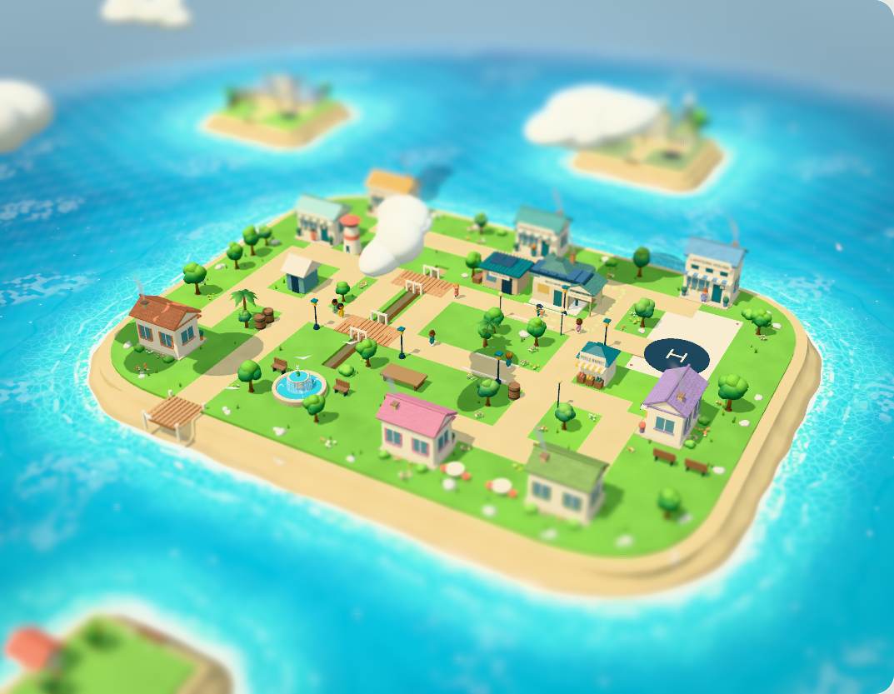
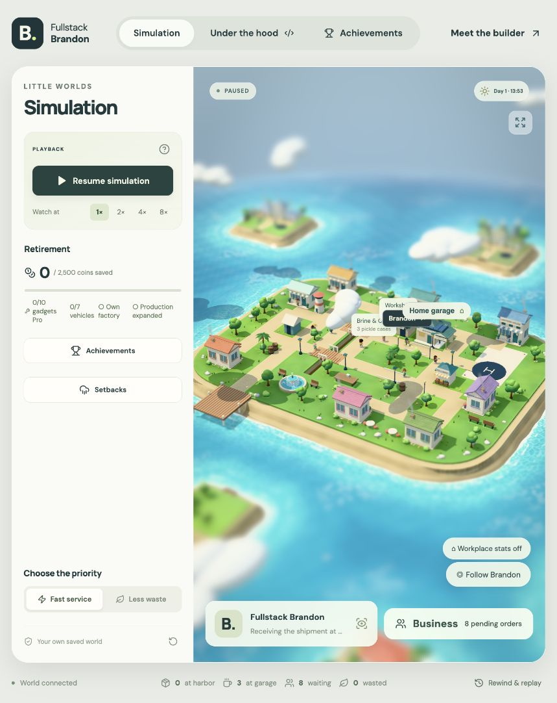
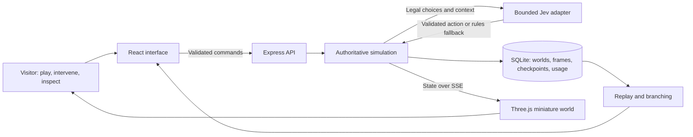
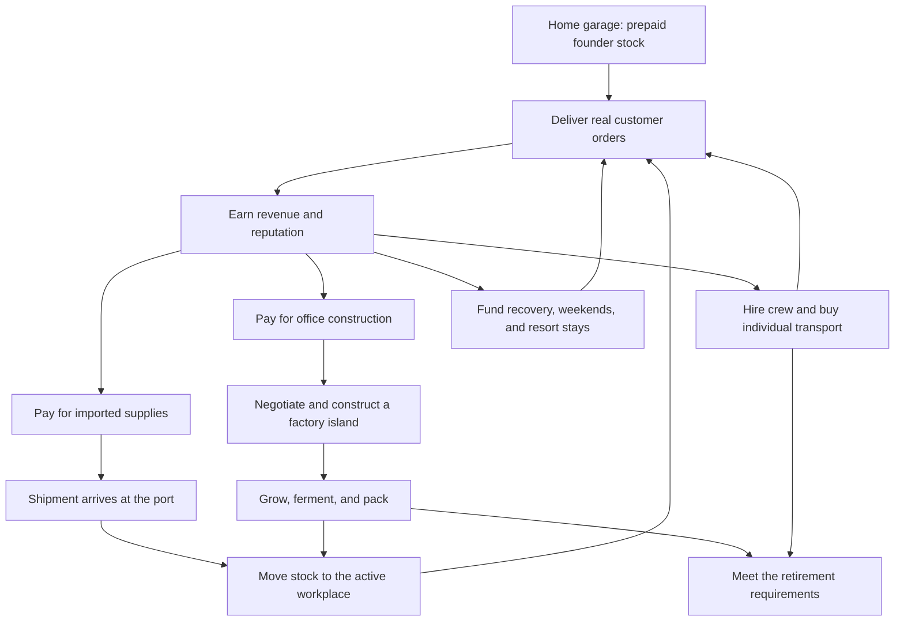
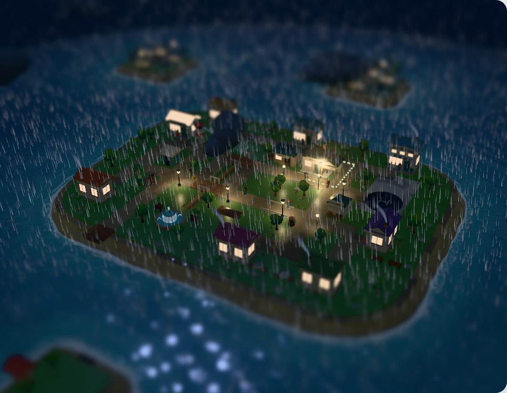

# Fullstack Brandon

### A little 3D version of me trying to build a pickle business.

I’m **Brandon Douglas**, and this is my interactive portfolio. I built the islands, the characters, the business simulation, and the interface around an AI controller that helps little Brandon decide what to do next. You can watch him work, mess with his plans, and open up the decision records to see how it went.

[Play Little Worlds](https://little-worlds-brandon.vercel.app/) · [Portfolio](https://douglasvisuals.com/little-worlds/)

The public portfolio edition runs entirely in your browser with React, Three.js, a simulation worker, and local visit saves. It uses the rules controller without an account or AI provider. GitHub releases on `main` automatically rebuild the same public game URL through Vercel. See [browser development and deployment](docs/BROWSER_DEPLOYMENT.md). The optional Node, Express, SQLite, and AI server edition remains available separately.



> Brandon starts in his garage with zero coins and six prepaid cases. He has to deliver enough pickles to pay for supplies, better transport, employees, and eventually a factory island. There are rocket skates in the fleet. I stand by that decision.

[Read the case study](docs/CASE_STUDY.md) · [Explore the architecture](docs/ARCHITECTURE.md) · [Meet the simulation](docs/SIMULATION.md) · [Understand the AI](docs/AI_AND_REPLAY.md) · [Run it locally](#run-it-locally)

## What you're looking at

I wanted to give people something to do when they open my portfolio. Close a road while I’m making a delivery. Suggest a purchase I can’t afford yet. Follow one of the employees around. There’s a lot more to talk about when you can see the software doing something.

The business runs on finite supplies and earned money. Employees have their own vehicles, wages, schedules, and fatigue. When I buy stock, a shipment has to reach the port, get unloaded, and make it to the workplace. Buying a factory island means paying for construction and then supplying the factory.

I care about those details. If you watch a crate move across the island, I want it to mean something happened to the inventory.

You can let Brandon run the business on his own or step in. Change his priorities, queue an investment, introduce a shortage, or give him some terrible weather. The engineering view lets you inspect his decisions, replay the run, and try a different action from a saved checkpoint.

## The five-minute tour

1. **Press Play.** A saved guest world begins its career. No account setup required.
2. **Follow Brandon.** Watch him collect supplies, travel, enter a business, and hand over an actual order.
3. **Open the business.** Inspect inventory, purchases, transport, production, crew, and customer reviews.
4. **Mess with the plan.** Close a bridge or introduce a shortage, then watch how he handles it.
5. **Look under the hood.** Inspect the recorded controller choice, replay the run, or branch from an available decision checkpoint.

You can watch at 1×, 2×, 4×, or 8× speed. The same supply, money, and delivery rules apply at every speed.



*These screenshots are from local development builds. The layout may differ a little from the current version.*

## What I built

| Layer | What it does | Where to inspect it |
| --- | --- | --- |
| Product experience | Character-led simulation, staged onboarding, operations controls, achievements, reviews, optional engineering tools | [`src/main.jsx`](src/main.jsx), [`src/components/`](src/components/) |
| 3D world | Miniature buildings, characters, props, fleet, ocean, shoreline, weather, lighting, and articulated motion | [`src/world.js`](src/world.js), [`src/Island.jsx`](src/Island.jsx), [`src/world-motion.js`](src/world-motion.js) |
| Simulation engine | Legal actions, seeded events, routing, inventory, money, production, progression, and retirement | [`shared/engine.js`](shared/engine.js), [`shared/realism.js`](shared/realism.js) |
| Logistics | Road graphs, transport footprints, swept collision checks, reservations, loading, physical handoffs, sea corridors | [`shared/traffic.js`](shared/traffic.js), [`src/navigation-path.js`](src/navigation-path.js), [`shared/shoreline.js`](shared/shoreline.js) |
| Backend | Guest ownership, commands, HTTP boundaries, server-sent events, simulation coordination | [`server/index.js`](server/index.js) |
| AI integration | Finite legal choices, provider timeout, validation, token reservations, transparent fallback | [`server/jev.js`](server/jev.js), [`shared/decision-trace.js`](shared/decision-trace.js) |
| Persistence | SQLite WAL, live state, replay frames, checkpoints, achievement collections, usage accounting | [`server/store.js`](server/store.js) |
| Verification and operations | Engine tests, production API tests, browser scenarios, deterministic evaluations, backups, container configuration, CI | [`tests/`](tests/), [`scripts/`](scripts/), [verification guide](docs/VERIFICATION.md) |

## The architecture, at a glance



I keep the business state on the server. Jev chooses from the actions the engine allows, and the browser renders what happens. That gives inventory, purchases, and saved history a single source of truth. It also means I can work on the animation without letting it change somebody’s balance.

## From the garage to a factory island



As the business grows, there’s more to manage: production inputs, wages, customer patience, breaks, and getting everyone home. The fleet includes a bike, van, rocket skates, sailboat, helicopter, jetpack, and teleporter. Each mode has its own movement and carrying rules, so buying one changes how deliveries work.

Read [the simulation field guide](docs/SIMULATION.md) for the supply chain, delivery lifecycle, workweek, transport tradeoffs, hazards, and achievement model.

## What Jev does

I ask Jev to choose **what Brandon should do next** from the actions the engine currently allows. I send it the operating context and those choices, then validate its response. Prices, stock, routes, and timing are calculated in code.

If configuration is missing, the request times out, the response is invalid or uncertain, or the allowance runs out, the rules controller takes over. The interface labels that fallback so you can see which controller acted.

The adapter reserves input-token allowance in SQLite before awaiting a provider response. Decisions record which controller acted. Saved lessons provide operating context from outcomes and feedback; this is persisted memory, not model retraining. Authored action cues explain the chosen activity, not private model reasoning.

I can look back at a choice and its result: did Brandon replenish stock, finish an order, or spend money on something that helped later? That’s what I wanted the decision inspector to show.

[Read the AI, replay, and evaluation guide →](docs/AI_AND_REPLAY.md)

## Building the 3D world

I build the scene in code, with named groups for characters, vehicles, buildings, and props. That lets me adjust the models and their animation together. The exporter creates reusable GLBs, and the browser batches static geometry by material to reduce draw calls. Moving actors stay separate.

Rendering includes day/night transitions, environmental weather, animated water, shoreline treatment, articulated characters, vehicle effects, route overlays, camera follow, and a miniature visual treatment. Automatic weather can be temporarily overridden for 180 simulated minutes before returning to the natural front. Thunder is optional and defaults off; reduced-motion behavior is handled explicitly.



[Read the world and motion guide →](docs/WORLD_AND_MOTION.md)

## Why this project represents me

I get interested in details like where the van parks and whether Brandon gets back into the same van after a delivery. Those details pull me into the rest of the system: the route, the parked equipment, the cargo he’s carrying, and the point where he’s allowed to choose another task.

That’s a good example of how I work on this project. I start with something I want to see happen, then work through what the software needs to remember to make it happen properly.

I’ve worked across the interface, 3D models, simulation rules, API, persistence, AI integration, and tests. Being able to follow a feature all the way through is a big part of why I wanted to build this.

If you're reviewing my work, start with [the case study](docs/CASE_STUDY.md). It connects the visible experience to the technical decisions and their tradeoffs. If you want to read the code first, start at [`shared/engine.js`](shared/engine.js), then follow one delivery through the server and renderer.

## Run it locally

Requires **Node.js 22.13+**. The backend uses Node's built-in SQLite support.

```sh
git clone https://github.com/bdouglas5/fullstackbrandon.git
cd fullstackbrandon
npm ci
npm run dev
```

Open [localhost:3000](http://localhost:3000). On macOS, `start-local.command` also installs missing dependencies, starts the app, and opens the browser.

Without a provider key, the app uses the labeled rules controller. To enable Jev, copy `.env.example` to `.env`, set `TYPESAFE_API_KEY` privately, and restart. The provider key stays on the server. Do not prefix it with `VITE_`.

```sh
cp .env.example .env
# Edit .env locally, then restart npm run dev.
```

| Command | Purpose |
| --- | --- |
| `npm run dev` | Start the local server and development frontend |
| `npm run build` | Export models and build the frontend |
| `npm start` | Serve the production build; build it first and configure `PUBLIC_ORIGIN` |
| `npm test` | Build, then run the Node test suite |
| `npx playwright install chromium` | Install the browser used by end-to-end tests |
| `npm run test:e2e` | Run Playwright browser scenarios |
| `npm run evaluate` | Run eight deterministic careers across four seeds, with and without disruptions |
| `npm run models` | Regenerate reusable GLB assets |
| `npm run backup` | Create a consistent SQLite backup |

## Tests and current limits

Tests cover engine behavior, geometry, motion, provider handling, persistence, session isolation, API/SSE behavior, and browser interaction. The evaluator uses actual engine transitions and writes local results under `evidence/`.

This public repository includes source, tests, selected screenshots, documentation, and CI configuration. Raw local captures, private worlds, provider configuration, and backups stay outside Git. Historical development notes are identified separately from the current verification guide.

I’ve prepared the app for **one Node process with persistent SQLite storage**. Public deployment, real-device performance, and human playtesting still need their own checks. The business uses invented prices and compressed production times; the [verification guide](docs/VERIFICATION.md) records the current results and limits.

[Verification and reproducible checks](docs/VERIFICATION.md) · [Deployment and recovery](docs/DEPLOYMENT.md)

## Go deeper

| Guide | What's inside |
| --- | --- |
| [Case study](docs/CASE_STUDY.md) | The product idea, design judgment, difficult boundaries, and what the work demonstrates |
| [Architecture](docs/ARCHITECTURE.md) | System flow, source map, ownership, persistence, API, and operational tradeoffs |
| [Simulation field guide](docs/SIMULATION.md) | Economy, supply chain, schedules, transport, disruptions, reviews, and achievements |
| [AI and replay](docs/AI_AND_REPLAY.md) | Provider contract, fallback, saved lessons, checkpoints, branching, and fair comparisons |
| [World and motion](docs/WORLD_AND_MOTION.md) | World assets, rendering, continuity, weather, camera, and performance |
| [Development guide](docs/DEVELOPMENT.md) | Setup, code navigation, testing strategy, and safe changes |
| [Verification](docs/VERIFICATION.md) | Exactly what can be checked, and the current publication checks |
| [Deployment](docs/DEPLOYMENT.md) | Environment, persistent storage, container setup, backup, and recovery |
| [Development history](docs/HISTORY.md) | Earlier briefs and implementation notes, with revision context |

**Brandon Douglas** · [GitHub](https://github.com/bdouglas5)
