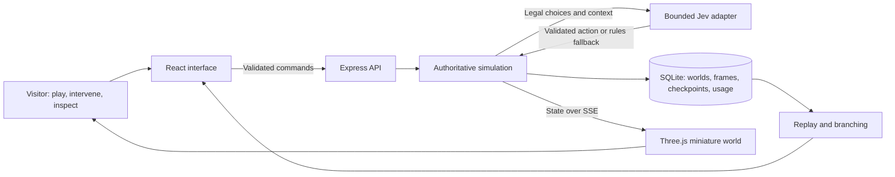
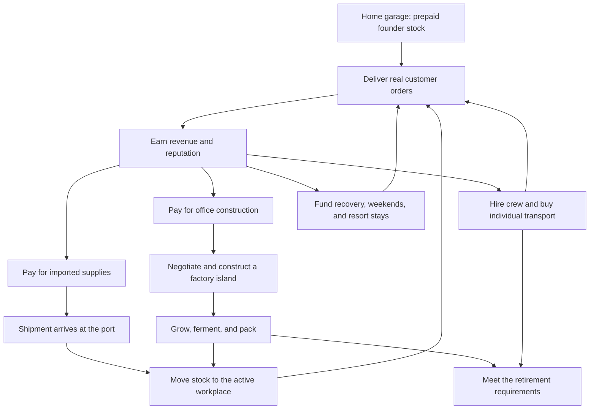

# Fullstack Brandon

### I built a tiny world to show how I think. Then I gave it a pickle economy.

**An interactive full-stack portfolio by Brandon Douglas.** A miniature 3D archipelago, an autonomous founder, a business with actual constraints, and an AI controller whose decisions you can inspect. React + Three.js in the browser. Node + Express + SQLite behind the curtain. A surprising amount of engineering between one jar of pickles and retirement.


> Start with zero coins, six prepaid cases, and your own two feet. Deliver. Earn. Build. Hire. Buy an island. Learn to take a weekend off. Eventually retire. Apparently my idea of a portfolio includes teaching a tiny version of myself how to stop working.

[Read the case study](docs/CASE_STUDY.md) · [Explore the architecture](docs/ARCHITECTURE.md) · [Meet the simulation](docs/SIMULATION.md) · [Understand the AI](docs/AI_AND_REPLAY.md) · [Run it locally](#run-it-locally)

## What you're looking at

I like building things people can explore and understand. For this project, I wanted the portfolio itself to be the work: a functioning system you can interrupt, investigate, and play with.

So I built a world where a small founder grows a wholesale pickle business. Every delivery changes inventory. Every investment costs money. Employees have their own transport, wages, schedules, and wellbeing. Shipments have to arrive at a port and move to the workplace. A factory has to be negotiated, built, supplied, and operated. The cheerful little island has accounting.

Visitors can let Brandon work, change priorities, queue investments, follow a courier, close routes, introduce setbacks, control the weather temporarily, and inspect what happened. The engineering view opens up the decisions, recorded outcomes, replay, and counterfactual branches.

The joke is the pickle empire. The engineering is the relationship between everything in it.

## The five-minute tour

1. **Press Play.** A saved guest world begins its career. No account setup required.
2. **Follow Brandon.** Watch him collect supplies, travel, enter a business, and hand over an actual order.
3. **Open the business.** Inspect inventory, purchases, transport, production, crew, and customer reviews.
4. **Cause a reasonable amount of trouble.** Close a bridge or introduce a shortage. See which legal choices remain.
5. **Look under the hood.** Inspect the recorded controller choice, replay the run, or branch from an available decision checkpoint.

Use 1×, 2×, 4×, or 8× playback. Faster playback changes simulated time; it does not mint free inventory. The tiny economy remains stubbornly interested in arithmetic.


*Repository images are selected captures from local development builds. They show the visual direction and working interface; they are not a claim of a publicly deployed service or the exact layout of every later revision.*

## What I built

| Layer | What it does | Where to inspect it |
| --- | --- | --- |
| Product experience | Character-led simulation, staged onboarding, operations controls, achievements, reviews, optional engineering tools | [`src/main.jsx`](src/main.jsx), [`src/components/`](src/components/) |
| Procedural 3D world | Original miniature buildings, characters, props, fleet, ocean, shoreline, weather, lighting, and articulated motion | [`src/world.js`](src/world.js), [`src/Island.jsx`](src/Island.jsx), [`src/world-motion.js`](src/world-motion.js) |
| Simulation engine | Legal actions, seeded events, routing, inventory, money, production, progression, and retirement | [`shared/engine.js`](shared/engine.js), [`shared/realism.js`](shared/realism.js) |
| Logistics | Road graphs, transport footprints, swept collision checks, reservations, loading, physical handoffs, sea corridors | [`shared/traffic.js`](shared/traffic.js), [`src/navigation-path.js`](src/navigation-path.js), [`shared/shoreline.js`](shared/shoreline.js) |
| Backend | Guest ownership, commands, HTTP boundaries, server-sent events, simulation coordination | [`server/index.js`](server/index.js) |
| AI integration | Finite legal choices, provider timeout, validation, token reservations, transparent fallback | [`server/jev.js`](server/jev.js), [`shared/decision-trace.js`](shared/decision-trace.js) |
| Persistence | SQLite WAL, live state, replay frames, checkpoints, achievement collections, usage accounting | [`server/store.js`](server/store.js) |
| Verification and operations | Engine tests, production API tests, browser scenarios, deterministic evaluations, backups, container configuration, CI | [`tests/`](tests/), [`scripts/`](scripts/), [verification guide](docs/VERIFICATION.md) |

## The architecture, at a glance



The engine owns the facts. The controller chooses among possible actions. The browser makes their consequences visible. That division lets the world be playful while keeping the accounting, ownership, and replay inspectable.

## The business is small. The consequences aren't.



This includes finite imported stock, local production inputs, wages, business hours, breaks, customer patience, simulated reviews, fatigue, and recovery. The fleet expands from walking to a bike, van, rocket skates, sailboat, helicopter, jetpack, and teleporter. Yes, the business can afford a teleporter. No, it cannot pretend it already delivered the cargo.

Read [the simulation field guide](docs/SIMULATION.md) for the supply chain, delivery lifecycle, workweek, transport tradeoffs, hazards, and achievement model.

## AI with a job description

Jev answers a bounded question: **which currently legal action should Brandon take?**

It receives a compact operating context and explicit choices. Application code owns prices, stock, eligibility, routes, clock advancement, and consequences. Responses are validated. Missing configuration, timeout, invalid responses, uncertainty, and exhausted allowances lead to a visibly labeled rules fallback.

The adapter reserves input-token allowance in SQLite before awaiting a provider response. Decisions record which controller acted. Saved lessons provide operating context from outcomes and feedback; this is persisted memory, not model retraining. Authored action cues explain the chosen activity, not private model reasoning.

My favorite part of this boundary is that it makes the interesting question testable: what did the controller choose, and what actually happened afterward?

[Read the AI, replay, and evaluation guide →](docs/AI_AND_REPLAY.md)

## A miniature world with a real rendering problem

The scene is authored in code. Named groups keep characters, vehicles, buildings, and props editable. A model exporter produces reusable GLB assets. A runtime optimization pass batches static geometry by material while moving actors remain independent.

Rendering includes day/night transitions, environmental weather, animated water, shoreline treatment, articulated characters, vehicle effects, route overlays, camera follow, and a miniature visual treatment. Automatic weather can be temporarily overridden for 180 simulated minutes before returning to the natural front. Thunder is optional and defaults off; reduced-motion behavior is handled explicitly.


[Read the world and motion guide →](docs/WORLD_AND_MOTION.md)

## Why this project represents me

I enjoy the point where design and engineering have to agree. A road closure should change the route you see. A delivery animation should correspond to stock that actually moves. A beautiful factory should be something the business earned and built. An AI decision should have an inspectable contract. A saved world should survive a refresh.

This project gives me room to work across the whole product: interface design, simulation rules, procedural graphics, API design, persistence, AI integration, performance, testing, and deployment preparation. Each layer has a purpose the visitor can encounter.

If you're reviewing my work, start with [the case study](docs/CASE_STUDY.md). It connects the visible experience to the technical decisions and their tradeoffs. If you want to read the code first, start at [`shared/engine.js`](shared/engine.js), then follow one delivery through the server and renderer.

## Run it locally

Requires **Node.js 22.13+**. The backend uses Node's built-in SQLite support.

```sh
git clone https://github.com/bdouglas5/fullstackbrandon.git
cd fullstackbrandon
npm ci
npm run dev
```

Open [localhost:3000](http://localhost:3000). On macOS, `start-local.command` also installs missing dependencies, starts the app, and opens the browser.

Without a provider key, the app uses the labeled rules controller. To enable Jev, copy `.env.example` to `.env`, set `TYPESAFE_API_KEY` privately, and restart. The provider key stays on the server. Do not prefix it with `VITE_`.

```sh
cp .env.example .env
# Edit .env locally, then restart npm run dev.
```

| Command | Purpose |
| --- | --- |
| `npm run dev` | Start the local server and development frontend |
| `npm run build` | Export procedural models and build the frontend |
| `npm start` | Serve the production build; build it first and configure `PUBLIC_ORIGIN` |
| `npm test` | Build, then run the Node test suite |
| `npx playwright install chromium` | Install the browser used by end-to-end tests |
| `npm run test:e2e` | Run Playwright browser scenarios |
| `npm run evaluate` | Run eight deterministic careers across four seeds, with and without disruptions |
| `npm run models` | Regenerate reusable GLB assets |
| `npm run backup` | Create a consistent SQLite backup |

## Evidence and honest boundaries

Tests cover engine behavior, geometry, motion, provider handling, persistence, session isolation, API/SSE behavior, and browser interaction. The evaluator uses actual engine transitions and writes local results under `evidence/`.

This public repository includes source, tests, selected screenshots, documentation, and CI configuration. Raw local captures, private worlds, provider configuration, and backups stay outside Git. Historical development notes are identified separately from the current verification guide.

The deployment model is **one Node process with persistent SQLite storage**. Multi-replica coordination, a live public deployment, physical-device performance, and human playtest acceptance are separate work. A simulated pickle factory is also not a food-safety, agricultural, employment-law, or commercial fleet-planning system. The production clocks and economics are deliberately compressed game rules.

[Verification and reproducible checks](docs/VERIFICATION.md) · [Deployment and recovery](docs/DEPLOYMENT.md)

## Go deeper

| Guide | What's inside |
| --- | --- |
| [Case study](docs/CASE_STUDY.md) | The product idea, design judgment, difficult boundaries, and what the work demonstrates |
| [Architecture](docs/ARCHITECTURE.md) | System flow, source map, ownership, persistence, API, and operational tradeoffs |
| [Simulation field guide](docs/SIMULATION.md) | Economy, supply chain, schedules, transport, disruptions, reviews, and achievements |
| [AI and replay](docs/AI_AND_REPLAY.md) | Provider contract, fallback, saved lessons, checkpoints, branching, and fair comparisons |
| [World and motion](docs/WORLD_AND_MOTION.md) | Procedural assets, rendering, continuity, weather, camera, and performance |
| [Development guide](docs/DEVELOPMENT.md) | Setup, code navigation, testing strategy, and safe changes |
| [Verification](docs/VERIFICATION.md) | Exactly what can be checked, and the current publication checks |
| [Deployment](docs/DEPLOYMENT.md) | Environment, persistent storage, container setup, backup, and recovery |
| [Development history](docs/HISTORY.md) | Earlier briefs and implementation notes, with revision context |

**Built by Brandon Douglas.** Tiny island. Large number of consequences.
