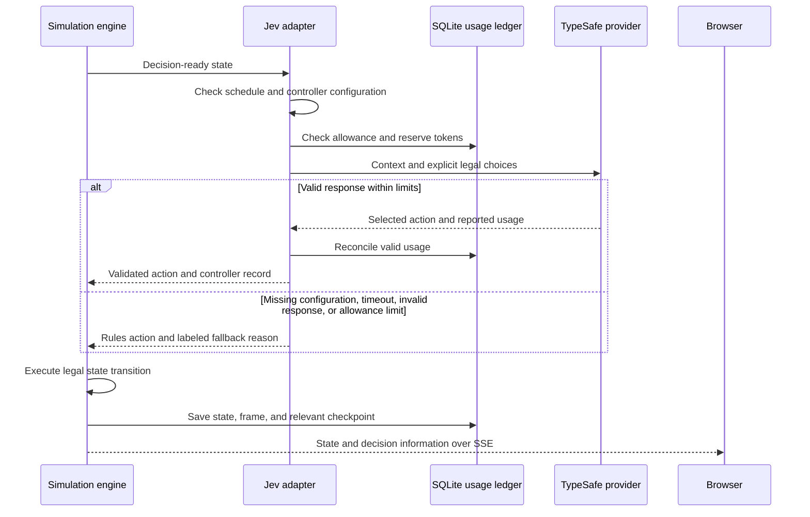
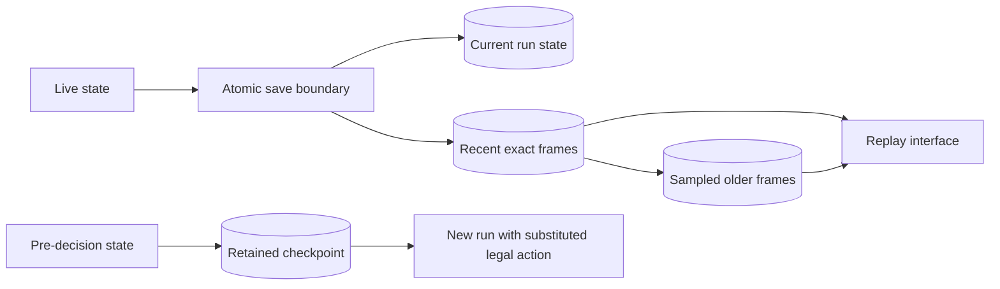

# The AI can make a choice. It cannot print pickles.

[Project](../README.md) · [Architecture](ARCHITECTURE.md) · [Verification](VERIFICATION.md)

I wanted an AI integration with a clear contract, visible consequences, and a useful failure mode. Jev selects an action from a finite eligible set. The engine remains responsible for exact execution.

## One decision, end to end

The diagram summarizes the flow. Some early exits, such as explicit rules mode or clock-out, avoid the provider entirely. Read [`server/jev.js`](../server/jev.js) for the exact control flow.

## The context has a purpose

The provider receives the operating situation: stock, carrying capacity, locations, schedule, wellbeing, construction, production, current equipment, customers, route conditions, and bounded saved experience. Legal choice descriptions include relevant costs and effects.

This is action selection at meaningful decision points. It is not a model request every rendered frame. Provider latency is recorded separately, and the coordinator pauses simulation advancement for the affected run while a decision is pending. The renderer and UI can keep presenting that pending state.

The engine computes routes and resource mutations. Jev is not being asked to do geometry, database work, or exact inventory arithmetic.

## Failure is part of the contract

| Condition | Behavior |
| --- | --- |
| Explicit rules mode | Use the deterministic controller |
| Missing provider credential | Use the rules fallback and identify the reason |
| Allowance exhausted | Avoid the request and fall back |
| Timeout or failed request | Fall back; preserve conservative budget accounting |
| Invalid or uncertain response | Reject it and use the fallback |
| Committed interaction unfinished | Finish the existing interaction before another decision |
| Scheduled clock-out is legal | Use the schedule policy |

Requests time out after five seconds. Before awaiting a request, the adapter synchronously reserves 4,096 input tokens in SQLite. Valid reported usage reconciles the reservation; failed requests retain it. Session call limits and a shared daily allowance persist in the usage ledger.

That design relies on one process owning the SQLite database and simulation coordination. A distributed implementation would need a different reservation and ownership mechanism.

The key remains server-side. The browser does not receive it, and the API is not an arbitrary provider proxy.

## What a decision record means

The inspector connects available choices, the chosen action, controller identity, fallback information where applicable, and the resulting world. Authored descriptions and action cues communicate the observed activity.

They do not expose private model reasoning. A displayed confidence signal is not proof of correctness. A valid response proves that the integration returned an eligible action; it does not prove the strategy was better than the baseline.

## Saved experience is operating memory

[`shared/learning.js`](../shared/learning.js) maintains bounded lessons based on recorded outcomes and feedback. The adapter can include this context in later decisions. The Learning panel lets visitors inspect the supporting evidence and later recovery observations.

A useful question is whether those lessons change behavior in a beneficial way across comparable conditions. The implementation supplies a mechanism to investigate that question. It does not claim model retraining or measured long-term learning gains.

## Replay is a recording, not another guess

Recorded frames reconstruct the world without calling the provider again. SQLite retains an exact recent window of 360 ticks and progressively coarser older snapshots. The UI shows the actual recorded tick.

That distinction matters during a long career: older history is sampled. The slider should not imply an exact frame exists for every historical tick.

The store uses a SQLite savepoint to keep live state, frame writes, and achievement collection updates consistent. Decision checkpoints support the choices still exposed for inspection.

## A branch asks a different question

A branch substitutes a legal action at a saved checkpoint and creates a separate run while preserving the original. It lets a visitor ask, “What if I chose this instead?”

That is a counterfactual exploration. A visitor who also changes weather, purchases, or other conditions has created a different experiment. Labeling a branch clearly prevents it from being mistaken for an unbiased controller comparison.

## A comparison needs matched conditions

The deterministic evaluator runs seeds 0, 7, 42, and 99, each unattended and disrupted: eight careers total. It records actual engine transitions and metrics under the rules controller. It makes no model requests and does not measure browser performance.

For a meaningful AI-versus-rules experiment, hold the engine version, seed, initial conditions, disruption timing, and objective constant. Record controller identity and fallback frequency alongside outcomes. Provider latency and token use are separate costs. A successful rules career is evidence about the rules system, not proof of Jev superiority.

Inspect [`scripts/evaluate-career.js`](../scripts/evaluate-career.js), [`shared/decision-trace.js`](../shared/decision-trace.js), [`tests/jev.test.js`](../tests/jev.test.js), [`tests/decision-trace.test.js`](../tests/decision-trace.test.js), and [`tests/learning.test.js`](../tests/learning.test.js).
