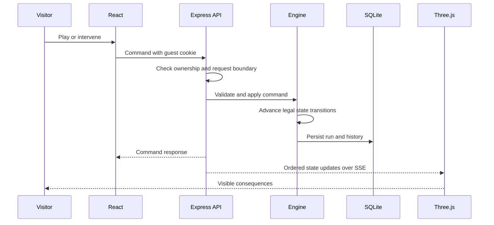
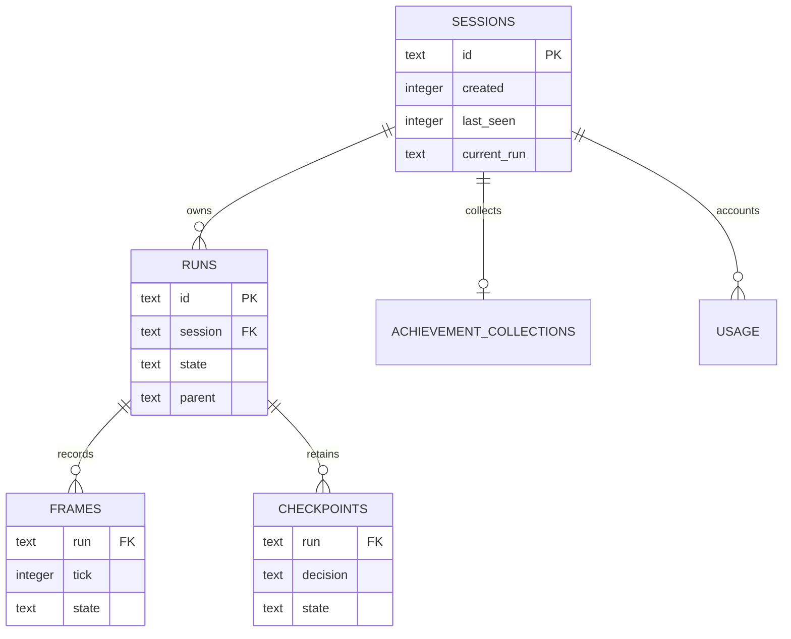

# How I put the app together

I keep the simulation, provider requests, and saved worlds on the server. React handles the controls and panels, and Three.js renders the state it receives. Here’s where the pieces live and why I arranged them this way.

## Source map

| Source | Responsibility |
| --- | --- |
| `src/main.jsx` | Session lifecycle, network state, world/replay selection, and page composition |
| `src/components/MissionPanel.jsx` | Mission progress, disruptions, and priorities |
| `src/components/InspectorPanel.jsx` | Decisions, recorded outcomes, branches, and comparisons |
| `src/components/EngineeringPanel.jsx` | Implementation explanation and recorded run diagnostics |
| `src/components/AboutPanel.jsx` | Portfolio introduction |
| `src/Island.jsx` | Rendering lifecycle, interpolation, camera, selection, labels, and cleanup |
| `src/world.js` | Original editable scene and articulated character construction |
| `src/optimize-world.js` | Runtime batching of static geometry while keeping dynamic meshes independent |
| `shared/realism.js` | Paid supplies, labor policy, business progression and production |
| `shared/workweek.js` | Weekly hours, weekend promises, paid resort recovery and Monday boost |
| `shared/traffic.js` | Swept footprints, road reservations, service bays and collision avoidance |
| `shared/learning.js` | Bounded experience, feedback, morale and adaptive operating reserves |
| `src/world-realism.js` | Home, staged office/island construction, factory, repair and transport animation |
| `src/components/OperationsPanel.jsx` | Supply chain, schedules, production and construction controls |
| `src/components/LearningPanel.jsx` | Inspectable lessons and feedback |
| `shared/engine.js` | Legal actions, routing, commands, simulation steps, and baseline comparison |
| `server/index.js` | HTTP boundaries, guest-session ownership, streaming, and simulation coordination |
| `server/store.js` | SQLite records, snapshots, and retention |
| `server/jev.js` | Provider contract, budget reservation, timeout, validation, and fallback |
| `tests/` | Simulation, provider, persistence, HTTP, model-container, and browser verification |

## Server-owned world state

The browser sends a small set of commands, not replacement inventory or character coordinates. The server validates commands and decides when an action is legal. This makes resource accounting, isolated guest worlds, persistence, and replay consistent. The browser interpolates successive positions for visual smoothness.

I chose this setup so purchases, guest ownership, saved history, and the private provider budget all go through the server. It means the browser needs to handle interpolation and network state, which is covered in the world and motion guide.

## Jev action selection

Each Jev request asks one bounded action-selection question over an explicit legal set. The response cannot invent a new command or directly move inventory. Timeouts and uncertain/invalid responses use a labeled deterministic fallback. The low confidence threshold is an initial game-specific setting, not a calibrated quality claim; tune it only after measuring real task outcomes.

Provider latency pauses simulation advancement for that run. This keeps the comparison about decisions rather than network speed; latency and usage are recorded separately. The UI distinguishes a pending decision from movement.

## Replay frames and branch checkpoints

A career continues until the fleet and upgraded workshop are complete and the retirement cash target is reached. Replays reconstruct recorded states without relying on repeating external model responses. Pre-decision checkpoints support substituting a legal action while retaining the original run. The last 360 ticks retain exact frames; older history uses a progressively coarser power-of-two sampling interval. This keeps the recent sequence detailed and older milestones reachable without unbounded storage. The replay slider shows the actual recorded tick, so sampled history is never represented as a complete frame-by-frame recording.

This uses more storage than a command-only event log. The initial service limits retained runs to 1000, expires inactive sessions after seven days, and supports consistent backups. Decision checkpoints are retained for the decisions still exposed by the live inspector. New careers start at zero cash on foot; a version mismatch starts a new career while older saved runs remain on disk.

## Procedural assets and runtime batching

Buildings, bridges, vegetation, props, and Brandon are authored as named mesh groups. The exporter emits GLB assets from that editable structure. The browser separately combines static meshes by material to reduce draw calls; characters, customers, crates, barriers, boat, and clouds remain independent.

The GLB exporter omits runtime canvas signage and the renderer's ocean/lighting. These are supplied by the application. The standalone character is exported at the origin and contains the base character; live carrying and walking behavior are driven by the application.

## A single-process deployment

One Node process owns active simulations and synchronous SQLite usage reservations. A persistent disk stores runs and budgets. I can back up that disk and restore interrupted worlds as paused.

Multiple replicas against one SQLite file are unsupported. Distributed deployment would require shared run ownership, transactional usage reservation, durable task coordination, and an appropriate database. The provided deployment package states this boundary explicitly.

## Gameplay and technical panels

The default view explains the autonomous business and offers Play. Visitors can let it run, accelerate simulated time, choose the next investment, follow a courier, inspect customer reviews, or introduce a disruption. Day/night and weather are simulation state, so replay and every browser see the same conditions. Weather fronts automatically alternate among clear skies, clouds, rain, fog, and storms. Creative weather controls apply a saved override for 180 simulated minutes, then restore the natural front; visitors can also resume automatic weather early. Storms render distant lightning bolts, respect reduced motion, and optionally play delayed synthesized thunder after a browser interaction. Thunder sound defaults off. The optional inspector presents the exact choices and recorded outcomes. The engineering panel explains the system and offers a data export without exposing provider credentials or guest-session secrets.

The game uses authored action cues and character labels. They explain observed intent and state; they are not claimed to be the model's internal reasoning.

## Follow the state through the system

The server checks which guest owns the run and applies each command through the engine. The renderer receives the resulting state after those checks.

## API surface

All run-specific routes enforce guest ownership. Mutating routes require the application header and enforce the configured origin boundary. The health route checks database connectivity.

| Method | Route | Responsibility |
| --- | --- | --- |
| GET | `/api/health` | Database health and simulation version |
| GET | `/api/session` | Guest session and saved-world context |
| POST | `/api/runs` | Create a run |
| POST | `/api/runs/:id/select` | Select a saved run |
| GET | `/api/runs/:id` | Read owned run state |
| POST | `/api/runs/:id/command` | Apply a validated command |
| GET | `/api/runs/:id/events` | Stream state with SSE |
| GET | `/api/runs/:id/history` | Retrieve retained replay history |
| GET | `/api/runs/:id/comparison` | Inspect matched baseline comparison |
| POST | `/api/runs/:id/branch` | Create a legal counterfactual branch |
| GET | `/api/runs/:id/export` | Export owned run evidence |

## Storage relationships

The diagram expresses logical relationships. `usage.session`, `current_run`, and `runs.parent` are application-managed references rather than all being declared SQL foreign keys. Frames and checkpoints use compound keys. The exact schema is in [`server/store.js`](../server/store.js).

State is stored as serialized simulation records. This favors inspectability and replay over a normalized table for every business object. A savepoint keeps related save operations consistent. WAL and the SQLite backup API support the operational model; they do not make simultaneous multi-process simulation ownership safe.

## What each part is responsible for

| Boundary | Guarantee supplied by the design | Separate concern |
| --- | --- | --- |
| Browser → API | Ownership checks and validated commands | Real deployment proxy and origin configuration |
| Engine → controller | Explicit legal action vocabulary | Strategic quality of choices |
| Controller → provider | Fixed request structure, timeout, budget reservation | Provider availability and real request performance |
| Engine → renderer | Authoritative state and shared movement rules | Frame continuity and device rendering performance |
| Store → replay | Recorded retained states | Older history is sampled |
| Checkpoint → branch | New run preserving original | Counterfactuals require careful comparison labels |
| Process → disk | Persistent worlds and consistent backups | Restore rehearsal and production storage reliability |

See [AI and replay](AI_AND_REPLAY.md), [world and motion](WORLD_AND_MOTION.md), and [deployment](DEPLOYMENT.md) for the detailed contracts.
