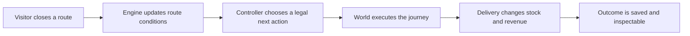

# Why I built Fullstack Brandon

[Back to the project](../README.md) · [Architecture](ARCHITECTURE.md) · [Simulation](SIMULATION.md)

I wanted somebody opening my portfolio to have something they could play with. In Fullstack Brandon, you can watch a little version of me run a pickle business, interfere with a delivery, and see what he does about it. If you’re curious about the code, the decision records and replay are right there.

The setting gives me room to make the work personal. I can build a small town, give the characters their own equipment, fuss over how a bike turns, and add rocket skates to a wholesale delivery business. Underneath all that, I still have to make the stock, money, routes, and saved state agree.

## Starting in the garage

Brandon begins on foot with zero coins and six prepaid cases. He needs to deliver orders before he can buy more supplies or better transport. Customers have different requests, patience, and equipment needs. Hiring an employee adds wages and another person who needs their own vehicle and time off.

I like how much you can explain through that setup. You see a customer waiting, a courier carrying cases, or a shipment reaching the harbor. When the workplace grows from a garage into an office and then a factory island, the supply chain changes too. The scene gives you a way to understand those changes while they’re happening.

You can open the technical panels when you want the details. I kept them out of the way of the main game because I’d rather let someone meet Brandon and try a delivery before asking them to read about SQLite.

## What’s happening behind the scene

| What you see | What the code is handling |
| --- | --- |
| A courier reaches a shop | Graph travel, traffic reservations, parking, entry, handoff, and inventory |
| A workplace gets built | Construction costs and stages, progression, and a new supply origin |
| A storm arrives | Saved weather state, transport restrictions, and visual transitions |
| Brandon waits for a decision | A bounded provider request and coordinated simulation advancement |
| You rewind the world | Recorded frames and retained decision checkpoints |
| The crew heads home | Scheduled hours, unfinished work, fatigue, and recovery |

## Keeping the business on the server

I put the authoritative state on the server. The browser sends commands, the server checks them, and the engine applies the consequences. The renderer receives that state and animates it.

This gives me one place to check purchases, stock, guest ownership, and AI usage. It also makes persistence and replay easier to reason about. A refresh should bring you back to your saved world with the same inventory.

There’s a cost to that choice. The browser has to interpolate between updates, and the interface has to explain when the controller is thinking or an action is unavailable. That’s extra coordination, but it lets me keep the business rules consistent while working on the presentation.

## Giving Jev a specific question

Jev chooses among actions that the engine has already checked. The engine computes the route and handles the stock, prices, timing, and effects. Each decision records which controller acted, including when the rules controller takes over.

The work starts before the provider request. I need to define useful choices with clear preconditions: can Brandon fulfill this order with what he’s carrying? Does he need equipment first? Is it time to replenish supplies or finish the shift? Sending a vague question to the model would leave too much of the business undefined.

Saved lessons give later requests context from outcomes and feedback. That’s persisted operating memory. The code doesn’t retrain Jev, and the authored action labels describe what Brandon is doing rather than the model’s private reasoning.

## Making purchases worth making

A cooler prevents packing-room spoilage and supports cold-chain orders. A generator keeps production going during an outage. A winch changes whether the helicopter can cross in a storm. Cargo racks change carrying capacity, and each courier has to own the transport they use.

I want to be able to buy something and notice the difference while playing. That means the catalog descriptions have to connect to actual rules in the engine. Even the teleporter needs a place in the cargo and progression model. It would be a pretty expensive way to discover your pickles are still at the garage.

## Getting a delivery all the way to the door

This is one of the parts I care about most. Brandon needs to park, get out, walk to the business, hand over the ordered cases, come back, and board the same equipment. A boat or helicopter needs its own arrival and shore approach.

That sequence involves more than a position on a map. The system has to remember his carrying state, parked vehicle, current mode, destination, and which interaction he’s finishing. A new decision has to wait until the committed interaction is complete.

The small details are easy to see when they’re wrong. If the route line ends somewhere other than the shop, or the van moves while its driver is inside, the whole delivery feels off. I use movement and traffic tests for the underlying rules, then browser review for how the sequence looks. Those checks answer different questions.

## Saving enough history to use it

A long career produces a lot of state. The store keeps exact frames for the last 360 ticks and samples older history more coarsely. The replay interface shows the recorded tick so you can tell what you’re looking at.

I also keep decision checkpoints for branching. You can substitute a legal action at a retained checkpoint and create another run without overwriting the original. Replay uses the saved states, so inspecting a past choice doesn’t depend on getting the same answer from the provider again.

The tradeoff is storage against historical detail. I keep the recent action precise and older milestones accessible. The architecture guide explains the retention policy.

## Running and recovering the app

The deployment setup uses one Node process and a persistent SQLite disk. That process owns the active simulations and reserves provider usage before making requests. The backup script uses SQLite’s backup API, and interrupted running worlds restore as paused.

This is a manageable setup for the current app. Running multiple replicas would need shared simulation ownership and transactional usage reservations. I’ve documented that separately so the deployment instructions match what the code can support.

## Where I’d start if I were reviewing the code

Try closing a route during a run, then follow the next decision through the inspector. Here’s the path that change takes:

For the source, I’d read these in order:

1. [Architecture](ARCHITECTURE.md), for how the parts fit together.
2. [`shared/engine.js`](../shared/engine.js) and [`shared/realism.js`](../shared/realism.js), for the business rules.
3. [`server/jev.js`](../server/jev.js), for the provider request and fallback handling.
4. [`server/store.js`](../server/store.js), for persistence, replay, and checkpoints.
5. [`shared/traffic.js`](../shared/traffic.js), [`src/Island.jsx`](../src/Island.jsx), and the motion modules, for how a delivery gets rendered.
6. [Verification](VERIFICATION.md), for the checks and their current results.

This project lets me work on graphics and backend behavior in the same afternoon. I can spend time on a tiny bicycle, then follow its delivery through the inventory model and the database. I wanted that range of work to be visible when someone visits my portfolio.
