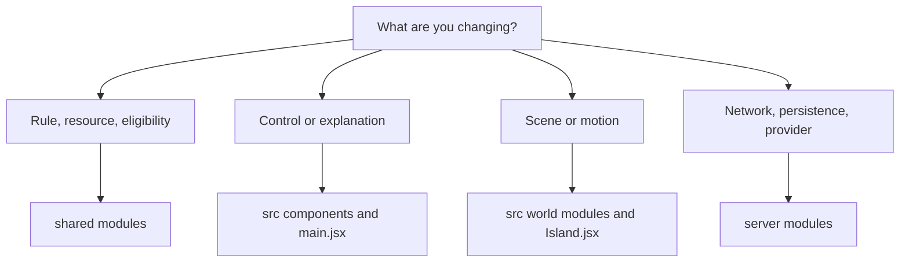

# Working on the little world

[Project](../README.md) · [Architecture](ARCHITECTURE.md) · [Verification](VERIFICATION.md)

## Setup

Use Node 22.13 or newer, then run `npm ci` and `npm run dev`. Open localhost:3000. Copy `.env.example` to `.env` only if you need local configuration. A provider credential is optional; missing configuration uses the labeled rules fallback.

The package is marked `private` to prevent accidental npm publication. The GitHub repository is public. Those settings describe different things.

## Find the right layer

Start with the state transition for a gameplay change. Define preconditions and effects, expose a command or action where appropriate, then connect the interface and scene. Updating only the animation can make something appear to happen without changing the actual business.

## Important files

| File or directory | Starting question |
| --- | --- |
| `shared/engine.js` | What is legal, and how does a tick change state? |
| `shared/realism.js` | How do supplies, construction, production, and wellbeing work? |
| `shared/traffic.js` | Where can an actor move safely? |
| `shared/learning.js` | Which bounded lessons are retained? |
| `server/index.js` | Who owns the run, and how is it advanced and streamed? |
| `server/store.js` | What is persisted, sampled, restored, or collected? |
| `server/jev.js` | What is sent to the provider, and what happens on failure? |
| `src/main.jsx` | How does the visitor select and control a world? |
| `src/Island.jsx` | How is the scene created, updated, selected, and disposed? |
| `src/world-motion.js` | How does state become continuous movement? |
| `src/components/` | How does a feature communicate its purpose? |
| `tests/` | What existing behavior must remain true? |

## Choosing checks

A resource or action change needs engine checks that cover accounting and prerequisites. A provider change needs invalid-response, timeout, usage, and fallback checks. A persistence change needs save, restore, ownership, replay, and branch checks. A scene change needs geometry or motion checks where meaningful and a rendered browser review.

I look for tests that catch something a visitor would notice or a saved world couldn't recover from: duplicated stock, access to someone else's run, a branch overwriting the original, or a courier using a vehicle they never bought. Those checks tell me more than a test that repeats the implementation.

`npm test` runs a build first. Browser tests use production servers and disposable databases; inspect their configuration for the relevant port and environment. Local scripts for captures and diagnostics may assume a running development server or specific local conditions. The supported entry points are the npm scripts in the README.

## Generated assets and local output

`npm run models` regenerates GLBs from procedural source. `npm run build` invokes it before bundling. Preserve the editable source when changing a model.

`data/`, `backups/`, `.env`, raw `evidence/`, and test-output directories are ignored. Store selected public documentation images under `docs/images/`. Check their content before publication; a debugging capture and a portfolio image have different purposes.

## Review a change as a visitor

Can someone see why an action happened? Does the destination agree with the route? Is a setback understandable? Does the world recover? Can a person choose another speed, inspect the evidence, and resume after refresh?

I use those questions when reviewing my changes. They help me catch the gap between a rule working in a test and someone being able to understand it in the browser.
