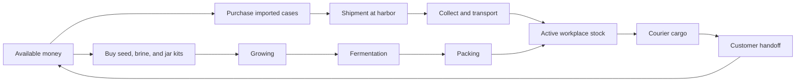
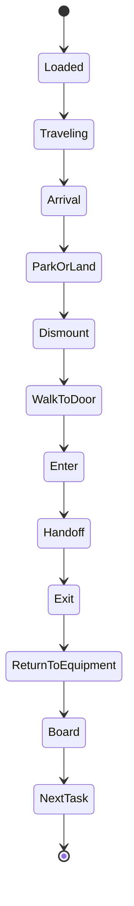
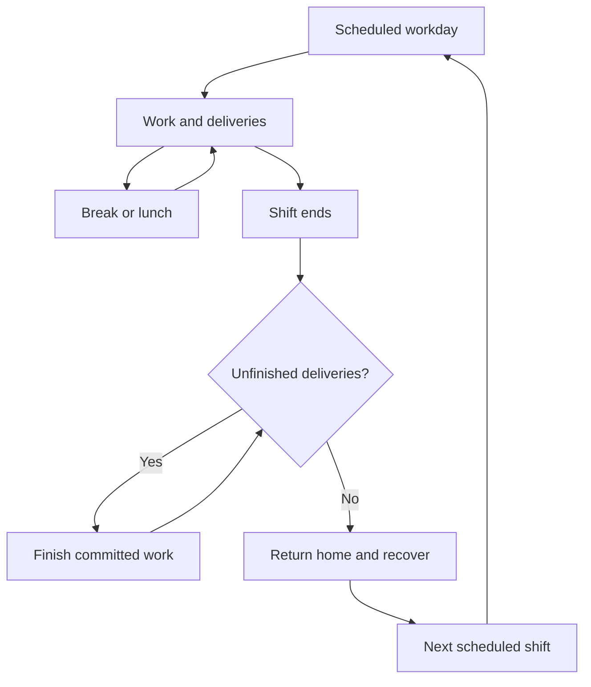

# Field guide to a suspiciously complicated pickle business

[Project](../README.md) · [Architecture](ARCHITECTURE.md) · [AI and replay](AI_AND_REPLAY.md)

The world starts small: a home garage, six prepaid cases, zero cash, and a founder on foot. Everything after that has to be earned through the simulation. This guide describes the implemented model; the [development history](HISTORY.md) preserves earlier ideas separately.

## The supply chain

Imported stock is finite and paid for. A purchase becomes a shipment. Cargo arrives through the harbor workflow and has to reach the active workplace before it can serve the business. The workplace progresses from garage to office to factory island.

Local production introduces another chain: buy inputs, grow produce, ferment it, then pack finished cases. Production depends on the current facilities and conditions. A blackout changes what can happen; the generator changes that constraint.

The durations are compressed game policies. I wanted a supply chain you can watch unfold in a browser session, not a calendar reminding you to return after actual fermentation.

Inspect [`shared/realism.js`](../shared/realism.js), [`shared/engine.js`](../shared/engine.js), [`src/world-freighter.js`](../src/world-freighter.js), and [`tests/shipment-flow.test.js`](../tests/shipment-flow.test.js).

## An order has a destination

Customers have named business identities, requested quantities, patience, tips, and sometimes equipment requirements. A cold-chain order needs the relevant cooler. Labels and other upgrades affect specific capabilities and earnings. Orders do not become complete just because the actor is vaguely near a colorful building.

The delivery lifecycle combines travel with a physical interaction:

This is a conceptual lifecycle; the concrete state fields and stages vary by transport and interaction. The engine gates decisions around committed interactions so a new choice does not casually abandon a handoff halfway through.

Cargo, parked equipment, and the active transport mode have to persist across interruptions. Destination approach, parking, actor footprints, and renderer continuity all participate in making that interaction believable.

Inspect [`tests/orders.test.js`](../tests/orders.test.js), [`tests/continuous-navigation.test.js`](../tests/continuous-navigation.test.js), [`tests/vehicle-motion.test.js`](../tests/vehicle-motion.test.js), and [`tests/controls-delivery.test.js`](../tests/controls-delivery.test.js).

## The fleet escalation is a personality test

| Mode | Role in the business | What makes it interesting |
| --- | --- | --- |
| Foot | The starting point and final approach to buildings | No purchased vehicle required; carrying and travel remain constrained |
| Bike | Early efficiency | Cargo and route behavior without van battery dependence |
| Van | Greater road capability | Battery, footprint, parking, upgrades, and tire trouble |
| Rocket skates | An entirely reasonable capital expenditure | Road movement with distinctive motion and hazard behavior |
| Sailboat | Inter-island transport | Water corridors, port approaches, weather, cargo, and return trips |
| Helicopter | Air transport | Vertical departure, crossing, landing, and storm eligibility |
| Jetpack | Small airborne trips | Its own capacity constraints and readable motion |
| Teleporter | Late progression | An extraordinary travel mechanism inside an ordinary inventory model |

The mode changes which rules matter. A bigger vehicle needs a bigger footprint. Water routes need valid corridors. Air travel must clear scenery. An employee cannot borrow a fleet entry that the founder owns unless the simulation explicitly supports that ownership.

Road motion uses graph routing, right-hand lanes, junction reservations, and swept footprint checks. These are targeted simulation mechanics, not a general rigid-body physics engine.

## The equipment has actual effects

The catalog is defined in [`shared/catalog.js`](../shared/catalog.js). Its descriptions also help communicate legal choices to Jev. Selected examples:

| Equipment | Gameplay effect |
| --- | --- |
| Jar-crate repair kit | Reduces tire-repair time |
| Wholesale crate rack | Expands carrying capacity, with transport-specific limits |
| Cold-brine cooler | Prevents packing-room spoilage and satisfies cold-chain needs |
| Waterproof jar wrap | Reduces storm travel penalties |
| Solar brine charger | Recovers battery under qualifying conditions |
| Barrel dolly | Speeds loading; the Pro upgrade adds capacity |
| Wholesale route planner | Improves road speed |
| Batch-label printer | Improves island-order earnings |
| Brine-room generator | Keeps production operating during outages |
| Cold-chain cargo winch | Allows otherwise constrained helicopter storm crossings |
| Absorbent spill kit | Enables a stop, dismount, cleanup, remount, and resume sequence |

The retirement target uses its own explicit required collection. Do not assume the number of catalog entries equals every progression requirement; inspect [`retirementRequirements`](../shared/achievements.js) for the current conditions.

## Work, recovery, and the revolutionary concept of going home

Schedules and workweeks affect productivity. The world includes business hours, lunch and rest breaks, weekly hours, fatigue, employee morale, wages, weekends, and paid recovery activities. Resort stays and later recovery can affect subsequent work.

Clock-out has to account for unfinished deliveries. Off-hours presentation can hide queued orders without deleting them. Rest advances time while preserving the visitor's base playback choice. These details matter because the interface should explain the day changing instead of making it look like orders disappeared.

These are invented labor and wellbeing policies for the game. They are not legal compliance rules. The important product relationship is that rest has a purpose and the business does not get unlimited labor for free.

Inspect [`shared/business-hours.js`](../shared/business-hours.js), [`shared/workweek.js`](../shared/workweek.js), [`tests/shift-clock.test.js`](../tests/shift-clock.test.js), and [`tests/workweek.test.js`](../tests/workweek.test.js).

## Give the plan something to recover from

Visitors can introduce disruptions such as bridge closures, traffic, demand rushes, shortages, storms, power loss, and tire trouble. The world also includes oil hazards and a zombie-defense subsystem. Yes, the pickle delivery application has encounter handling. Scope is a fascinating animal.

A disruption should change eligibility, timing, resources, or route conditions. The controller then chooses among the remaining legal actions. Gadgets and reserves can soften the effect, but the setback still belongs to the saved world.

Weather normally follows automatic fronts. A creative override lasts 180 simulated minutes and then resumes automatic conditions. An explicit automatic setting can resume the natural weather earlier. Visual lightning, rain, atmospheric effects, and optional thunder represent the environment without moving authority into the renderer.

Inspect [`shared/hazards.js`](../shared/hazards.js), [`shared/combat.js`](../shared/combat.js), [`tests/hazards.test.js`](../tests/hazards.test.js), and [`tests/combat.test.js`](../tests/combat.test.js).

## Reviews and lessons come from events

Customer reviews summarize simulated delivery performance. They are not real testimonials. The review board exposes the relevant delivery evidence rather than treating a star rating as unexplained decoration.

Saved lessons draw from outcomes, customer feedback, employee conditions, visitor suggestions, and recurring disruptions. They can inform operating reserves and controller context. Later observations help show whether recovery followed. This is a bounded experience system, not proof that a model acquired a durable new skill.

## Achievements preserve both discovery and causality

Achievements form prerequisite paths rather than a flat sticker sheet. The store can retain a guest's discoveries across runs, while actual engine prerequisites still depend on what the current run earned. Discovering a trophy in an old career should not hand a new founder a free factory.

Retirement requires satisfying the explicit business, equipment, fleet, production, crew, and savings conditions. The team has to get safely home. That makes completion a state the world reaches, not just a banner attached to a large coin balance.

Inspect [`shared/achievements.js`](../shared/achievements.js), [`src/components/Achievements.jsx`](../src/components/Achievements.jsx), and [`tests/achievements.test.js`](../tests/achievements.test.js).
