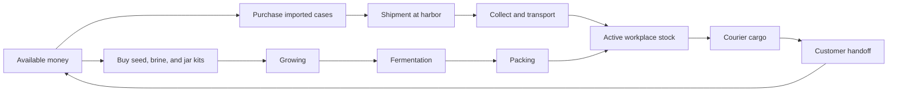
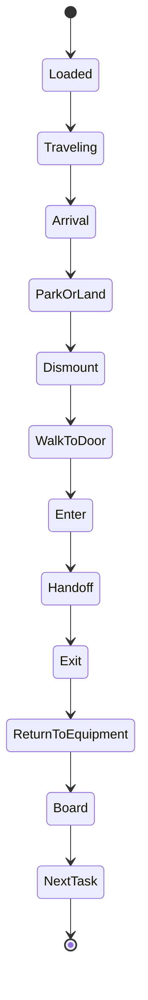
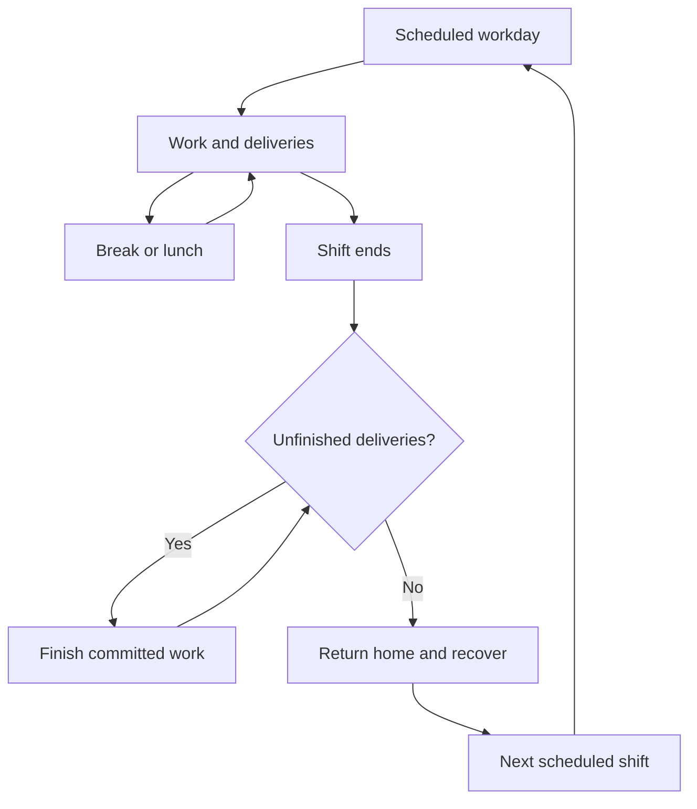

# How the pickle business works

[Project](../README.md) · [Architecture](ARCHITECTURE.md) · [AI and replay](AI_AND_REPLAY.md)

Little Brandon starts in his garage with six prepaid cases, zero cash, and no vehicle. I use that starting point to make the later purchases matter: he has to earn the money for each one. This guide covers the current rules. Earlier ideas are in the [development history](HISTORY.md).

## The supply chain

Imported stock is finite and paid for. A purchase becomes a shipment. Cargo arrives through the harbor workflow and has to reach the active workplace before it can serve the business. The workplace progresses from garage to office to factory island.

Local production introduces another chain: buy inputs, grow produce, ferment it, then pack finished cases. Production depends on the current facilities and conditions. A blackout changes what can happen; the generator changes that constraint.

I shortened growing and fermentation times so you can see the production cycle during a browser session. The order of the stages still matters, even though the timing is invented for the game.

Inspect [`shared/realism.js`](../shared/realism.js), [`shared/engine.js`](../shared/engine.js), [`src/world-freighter.js`](../src/world-freighter.js), and [`tests/shipment-flow.test.js`](../tests/shipment-flow.test.js).

## An order has a destination

Customers have their own businesses, requested quantities, patience, tips, and sometimes equipment requirements. A cold-chain order needs the cooler. Labels and other upgrades affect capabilities and earnings. The delivery has to reach the customer and finish the handoff before the order counts as complete.

The delivery lifecycle combines travel with a physical interaction:

This diagram groups the stages for readability; the state fields vary by transport and interaction. Once Brandon starts a committed interaction, the engine makes him finish it before choosing another task.

An interruption has to preserve his cargo, parked equipment, and travel mode. I also need the approach path, parking position, and actor footprint to agree with what the browser draws.

Inspect [`tests/orders.test.js`](../tests/orders.test.js), [`tests/continuous-navigation.test.js`](../tests/continuous-navigation.test.js), [`tests/vehicle-motion.test.js`](../tests/vehicle-motion.test.js), and [`tests/controls-delivery.test.js`](../tests/controls-delivery.test.js).

## Transport

| Mode | Role in the business | What makes it interesting |
| --- | --- | --- |
| Foot | The starting point and final approach to buildings | No purchased vehicle required; carrying and travel remain constrained |
| Bike | Early efficiency | Cargo and route behavior without van battery dependence |
| Van | Greater road capability | Battery, footprint, parking, upgrades, and tire trouble |
| Rocket skates | Fast road transport | Road movement with distinctive motion and hazard behavior |
| Sailboat | Inter-island transport | Water corridors, port approaches, weather, cargo, and return trips |
| Helicopter | Air transport | Vertical departure, crossing, landing, and storm eligibility |
| Jetpack | Small airborne trips | Its own capacity constraints and readable motion |
| Teleporter | Late progression | Travel still follows cargo and progression rules |

The mode changes which rules matter. A bigger vehicle needs a bigger footprint. Water routes need valid corridors. Air travel must clear scenery. An employee cannot borrow a fleet entry that the founder owns unless the simulation explicitly supports that ownership.

Road motion uses graph routing, right-hand lanes, junction reservations, and swept footprint checks. These are targeted simulation mechanics, not a general rigid-body physics engine.

## The equipment has actual effects

The catalog is defined in [`shared/catalog.js`](../shared/catalog.js). Its descriptions also help communicate legal choices to Jev. Selected examples:

| Equipment | Gameplay effect |
| --- | --- |
| Jar-crate repair kit | Reduces tire-repair time |
| Wholesale crate rack | Expands carrying capacity, with transport-specific limits |
| Cold-brine cooler | Prevents packing-room spoilage and satisfies cold-chain needs |
| Waterproof jar wrap | Reduces storm travel penalties |
| Solar brine charger | Recovers battery under qualifying conditions |
| Barrel dolly | Speeds loading; the Pro upgrade adds capacity |
| Wholesale route planner | Improves road speed |
| Batch-label printer | Improves island-order earnings |
| Brine-room generator | Keeps production operating during outages |
| Cold-chain cargo winch | Allows otherwise constrained helicopter storm crossings |
| Absorbent spill kit | Enables a stop, dismount, cleanup, remount, and resume sequence |

The retirement target uses its own explicit required collection. Do not assume the number of catalog entries equals every progression requirement; inspect [`retirementRequirements`](../shared/achievements.js) for the current conditions.

## Work hours and going home

Schedules and workweeks affect productivity. The world includes business hours, lunch and rest breaks, weekly hours, fatigue, employee morale, wages, weekends, and paid recovery activities. Resort stays and later recovery can affect subsequent work.

When Brandon is clocked out on a weekend he spends 09:00–19:00 at the west-shore beach cove (the `beach_day` action, layout in `shared/beach.js`), lounging on a chair while neighbours gather on the sand. "Skip the weekend" fast-forwards to Monday; "Spend it at the beach" (or the Operations panel suggestion) keeps him on the sand all weekend.

Clock-out has to account for unfinished deliveries. Off-hours presentation can hide queued orders without deleting them. Rest advances time while preserving the visitor's base playback choice. These details matter because the interface should explain the day changing instead of making it look like orders disappeared.

I use game-specific work and wellbeing policies here. Extra hours affect productivity, rest provides recovery, and wages cost money. See the source for the exact rules; these timings and policies aren’t employment-law guidance.

Inspect [`shared/business-hours.js`](../shared/business-hours.js), [`shared/workweek.js`](../shared/workweek.js), [`tests/shift-clock.test.js`](../tests/shift-clock.test.js), and [`tests/workweek.test.js`](../tests/workweek.test.js).

## Give the plan something to recover from

You can close the bridge, add traffic, rush orders, or trigger shortages, storms, power loss, and tire trouble. There are oil hazards and zombies too. The zombie system has encounter handling and its own tests, which is a sentence I get to write in the documentation for my pickle business.

A disruption should change eligibility, timing, resources, or route conditions. The controller then chooses among the remaining legal actions. Gadgets and reserves can soften the effect, but the setback still belongs to the saved world.

Weather normally follows automatic fronts. A creative override lasts 180 simulated minutes and then resumes automatic conditions. An explicit automatic setting can resume the natural weather earlier. Visual lightning, rain, atmospheric effects, and optional thunder represent the environment without moving authority into the renderer.

Inspect [`shared/hazards.js`](../shared/hazards.js), [`shared/combat.js`](../shared/combat.js), [`tests/hazards.test.js`](../tests/hazards.test.js), and [`tests/combat.test.js`](../tests/combat.test.js).

## Reviews and lessons come from events

Customer reviews summarize simulated delivery performance. They are not real testimonials. The review board exposes the relevant delivery evidence rather than treating a star rating as unexplained decoration.

Saved lessons draw from outcomes, customer feedback, employee conditions, visitor suggestions, and recurring disruptions. They can inform operating reserves and controller context. Later observations help show whether recovery followed. This is a bounded experience system, not proof that a model acquired a durable new skill.

## Achievements across runs

Achievements have prerequisite paths. I keep a guest’s discoveries across runs so they can see what they’ve found, but the new career still has to earn its own upgrades. A factory trophy from a previous run won’t pay for the next factory.

Retirement requires satisfying the explicit business, equipment, fleet, production, crew, and savings conditions. The team has to get safely home. The coin balance is only part of finishing the career.

Inspect [`shared/achievements.js`](../shared/achievements.js), [`src/components/Achievements.jsx`](../src/components/Achievements.jsx), and [`tests/achievements.test.js`](../tests/achievements.test.js).
