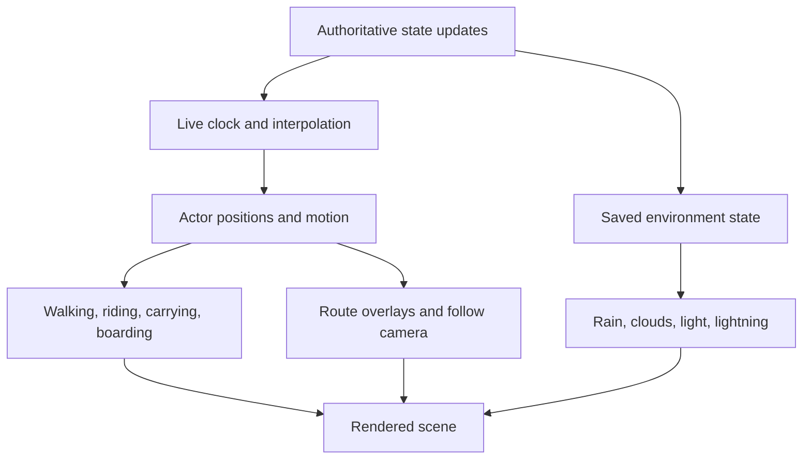

# Building the world around the rules

[Project](../README.md) · [Simulation](SIMULATION.md) · [Architecture](ARCHITECTURE.md)

I want the island to look like a little model you could pick up. I also want you to be able to follow a delivery without reading the status panel the whole time. Building the scene in code lets me adjust the models, routes, and animation together.

## Procedural models

Buildings, terrain, shoreline, vegetation, props, characters, and vehicles are constructed as named mesh groups. The structure makes it possible to change proportions, material treatment, pose, and articulation in source.

[`scripts/export-models.js`](../scripts/export-models.js) generates reusable GLB assets from that structure. The runtime separately supplies application lighting, ocean treatment, and canvas signage. A model export is not the entire live scene.

| Area | Main source |
| --- | --- |
| World assembly | [`world.js`](../src/world.js), [`world-layout.js`](../src/world-layout.js), [`world-buildings.js`](../src/world-buildings.js) |
| Toy proportions and materials | [`toy-scale.js`](../src/toy-scale.js), [`toy-kit.js`](../src/toy-kit.js), [`toy-shading.js`](../src/toy-shading.js), [`model-finishes.js`](../src/model-finishes.js) |
| Character and cast | [`figurine.js`](../src/figurine.js), [`cast.js`](../src/cast.js), [`character-motion.js`](../src/character-motion.js) |
| Transport | [`toy-transport.js`](../src/toy-transport.js), [`toy-vehicles.js`](../src/toy-vehicles.js), [`world-motion.js`](../src/world-motion.js) |
| Water and shoreline | [`world-water.js`](../src/world-water.js), [`world-shoreline.js`](../src/world-shoreline.js), [`shoreline.js`](../shared/shoreline.js) |
| Weather and light | [`world-atmosphere.js`](../src/world-atmosphere.js), [`world-rain.js`](../src/world-rain.js), [`world-thunder.js`](../src/world-thunder.js), [`world-lighting.js`](../src/world-lighting.js) |
| Rendering lifecycle | [`Island.jsx`](../src/Island.jsx), [`optimize-world.js`](../src/optimize-world.js), [`adaptive-resolution.js`](../src/adaptive-resolution.js) |

## Simulation time and animation

The simulation advances through authoritative ticks. The browser renders at its own cadence and interpolates between state updates. Playback speed changes the relationship between simulated time and elapsed time; animation still needs a continuous journey.

The difficult cases are transitions: a new route, an interruption, parking, dismounting, boarding, entry, a replay seek, and returning from a sea voyage. Position, pose, cargo, equipment visibility, and camera tracking need to stay consistent across those events.

Inspect [`src/live-clock.js`](../src/live-clock.js), [`src/navigation-path.js`](../src/navigation-path.js), [`src/world-motion.js`](../src/world-motion.js), and the live-clock, continuous-navigation, character-motion, and vehicle-motion tests.

## Routes and building approaches

The route overlay needs to end at the building Brandon is actually serving. If it points to the center of town while he walks into another shop, you can’t use it to follow the delivery. I treat that as a UI bug even when the inventory updates correctly.

Shared route and shoreline rules help keep scene movement aligned with the simulation. Aircraft need departure and landing clearance; boats need water paths and shore handoffs. Foot traffic and vehicles have different footprints, and junction behavior has to avoid creating deadlocks between those modes.

The traffic model uses swept distance checks so a fast actor cannot simply step through a slower actor between samples. It also handles reservations and service approaches. These mechanics are designed for this world rather than general physical simulation.

## Weather belongs to the saved run

Day/night and weather are simulation state. The scene translates them into visual conditions: light and sky changes, rain, clouds, fog, storm intensity, lightning, and optional delayed synthesized thunder.

Automatic fronts remain the default. Temporary overrides expire in simulated time. Thunder defaults off and requires browser interaction before audio can play. Reduced-motion handling changes the presentation of effects without making the server's weather disappear.

I need to be able to follow the action at night and in bad weather too. That means checking labels, lighting, and contrast in those states as well as daylight.

## Rendering cost

The runtime optimization pass batches static meshes by material. Moving characters, customer actors, cargo, vehicles, clouds, and other dynamic elements remain independently controllable. Adaptive resolution provides another lever when rendering becomes expensive.

When I batch meshes or change resolution, I check that selection, labels, and animation still work. The performance change has to leave the courier recognizable and the task readable.

The repository includes tests for geometry, shading, optimization, effects, lighting, camera motion, and adaptive resolution. Browser tests exercise the rendered experience. Hardware FPS, sustained device performance, mobile battery use, and human readability require their own measurements.

## How I'd inspect a visual change

1. Observe the world at 1× and accelerated playback.
2. Follow a complete delivery, including the building approach and return to equipment.
3. Compare clear day, night, rain, storm, and reduced-motion states.
4. Exercise follow camera, orbit, zoom, route overlays, selection, and replay seeking.
5. Check desktop and a narrow viewport; test real devices separately when making device-performance claims.

These are the views I check when I’m changing the scene. A delivery can look fine from one camera angle and reveal a problem as soon as I follow the courier.
